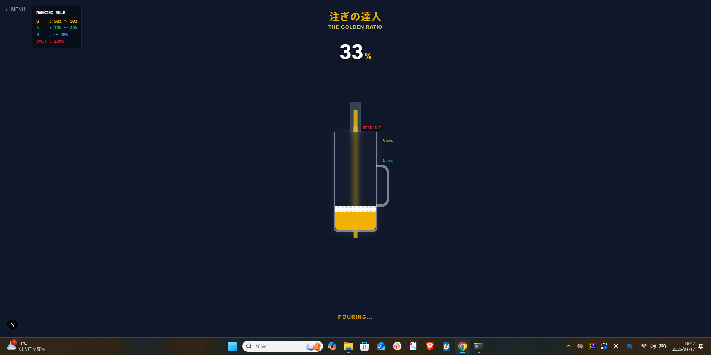
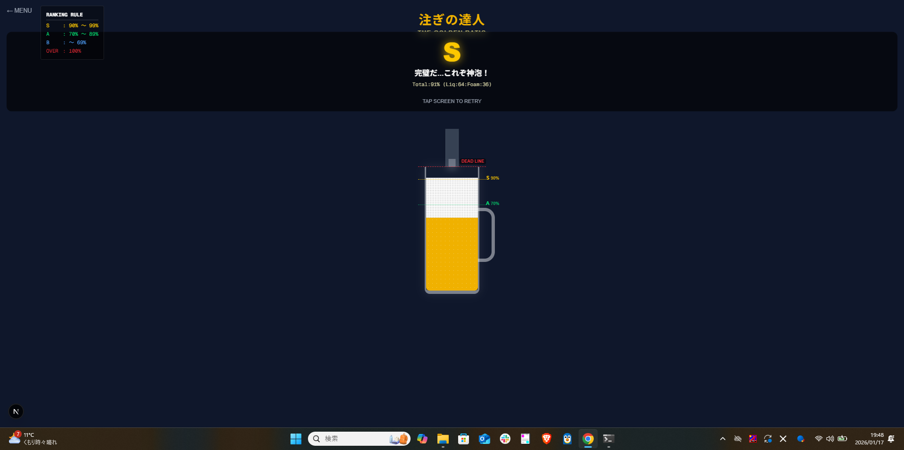
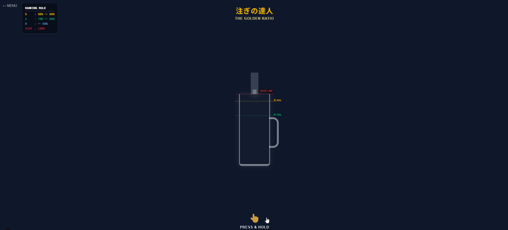

# 注ぎの達人 - The Golden Ratio Beer Game 

黄金比を目指してビールを注ぐ、ブラウザベースのミニゲームです。
Next.js (App Router) + TypeScript で構築されています。




##  遊び方

シンプルですが、奥が深い「チキンレース」ゲームです。

1. **操作方法**: 画面を**長押し（クリックしてホールド）**するとビールが注がれます。
2. **停止**: 指（マウス）を離すと注ぐのが止まり、判定が行われます。
3. **ルール**:
   - グラスの **100% (MAX)** を超えると即ゲームオーバーです。
   - ギリギリを攻めるほど高評価になります。

###  ランク判定基準

| ランク | 範囲 | 評価 |
| :---: | :--- | :--- |
| **S** | **90% 〜 99%** | **神泡** (Perfect) - ギリギリを見切った達人の領域 |
| **A** | **70% 〜 89%** | **合格** (Nice) - 美味しそうな見た目 |
| **B** | **〜 69%** | **不足** (Bad) - 守りに入りすぎです |
| (ゲームオーバー) | **100%〜** | **GAMEOVER** - 溢れてしまいました |

## 技術スタック

- **Framework**: [Next.js](https://nextjs.org/) (App Router)
- **Language**: TypeScript
- **Styling**: Tailwind CSS
- **Logic**: Custom React Hooks (`useBeerGame`) with Delta Time calculation

## ローカルでの実行方法

リポジトリをクローンした後、以下のコマンドで起動できます。

```bash
# 依存関係のインストール
npm install
# または
pnpm install

# 開発サーバーの起動
npm run dev
# または
pnpm dev